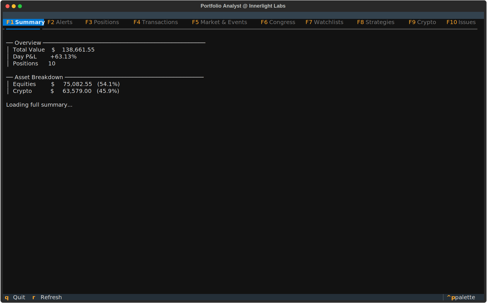
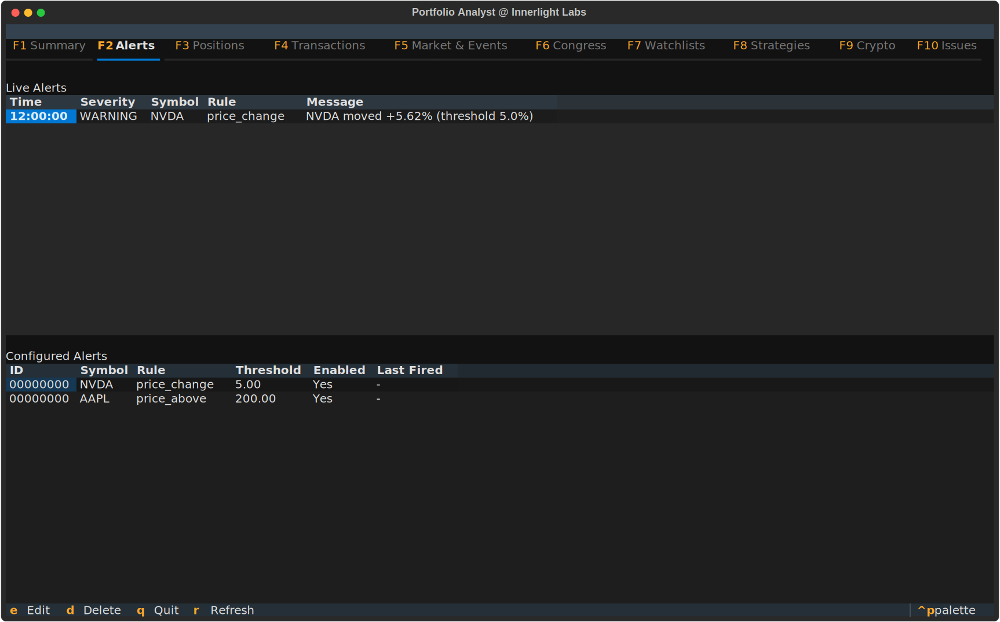
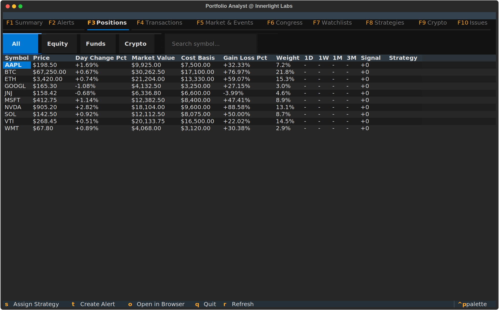
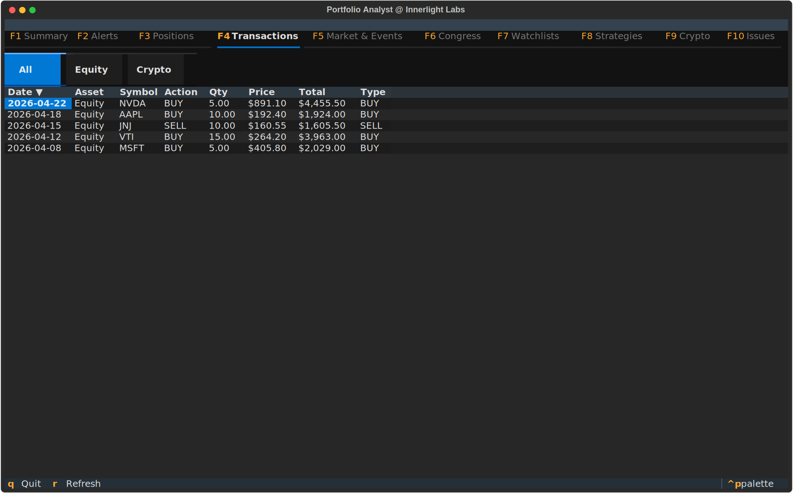
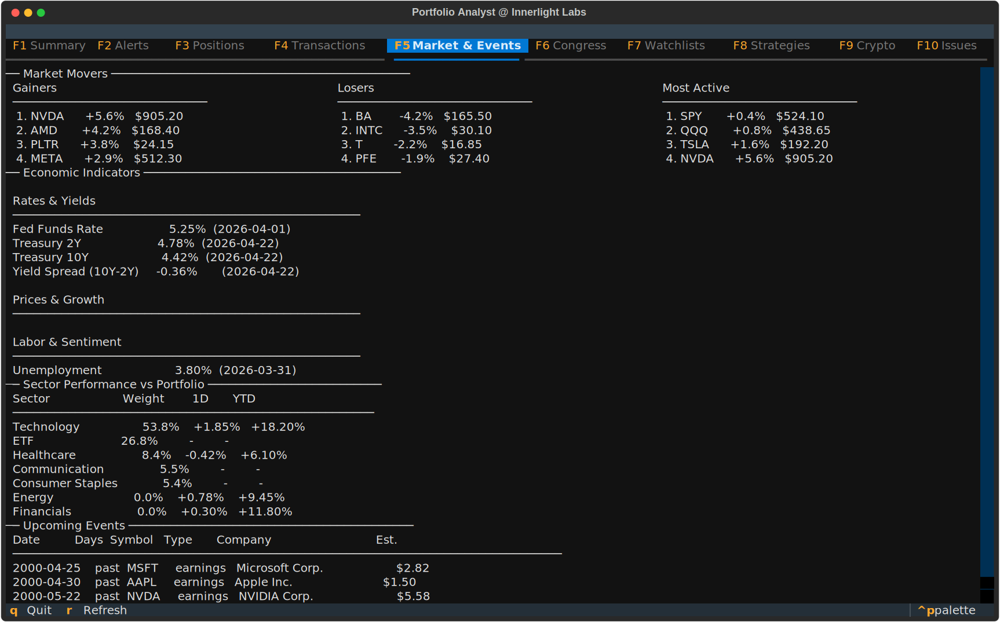
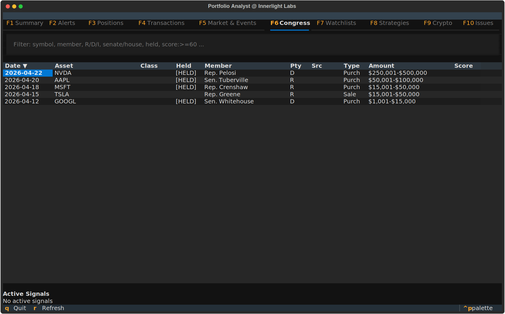
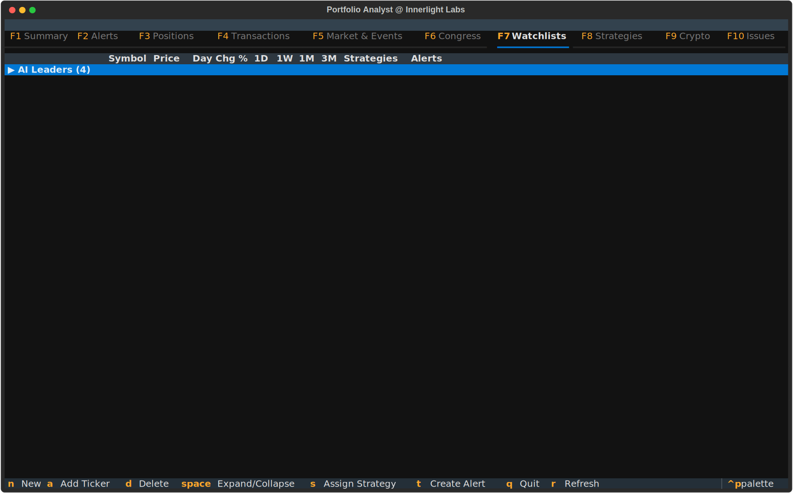
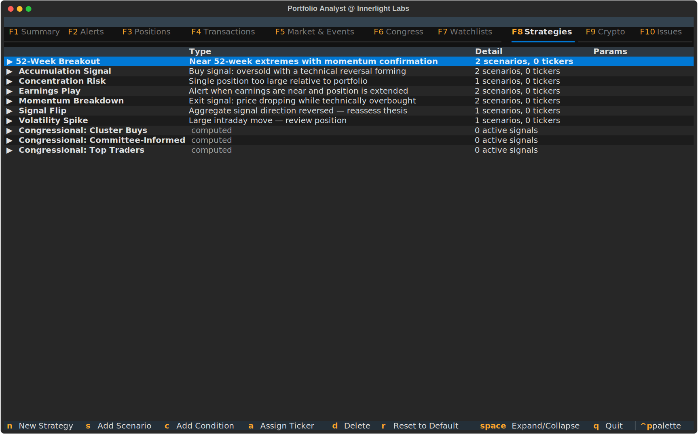
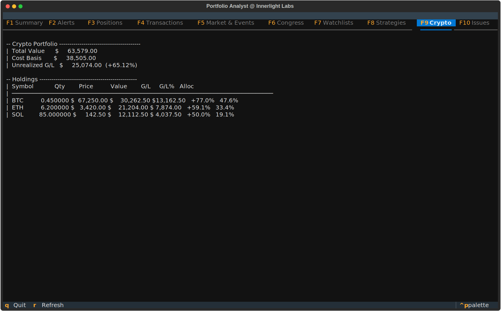
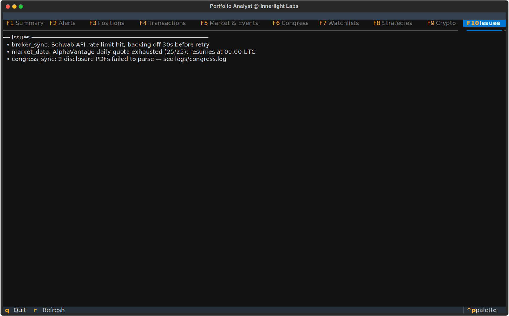

# Portfolio Analyst

> **Status: Closed Beta.** Portfolio Analyst is currently distributed to a small group of invited users while we harden broker integrations and the cloud sync layer. Access is by invitation only. Public release will follow once the closed-beta cohort has signed off.

A desktop tool for monitoring and analyzing personal investment portfolios. Aggregates holdings across brokerage accounts, surfaces real-time signals on price, valuation, and momentum, and tracks configurable alerts and strategies against your positions and watchlists.

### Supported brokers

First-class integrations (live OAuth sync of holdings, transactions, and quotes):

- **Charles Schwab** — equities, ETFs, mutual funds, options. Cloud-sync uses the Innerlight Labs shared Schwab developer credentials; local-auth mode is available for users who supply their own.
- **Coinbase** — spot crypto holdings via API key. Configured per-user with `portfolio enable coinbase`.

Other brokers are not currently supported as live integrations. CSV transaction import (`portfolio import --transactions <file> --broker NAME`) works for ad-hoc loading from any broker that exports trade history, but holdings won't sync live and quotes won't tick.

This repository distributes release binaries for macOS, Linux, and Windows. Download the latest from the [Releases](https://github.com/innerlightlabs-org/portfolio-analyst/releases) page — stable builds use tags like `v1.2.0`, beta builds are marked as pre-releases.

## Install via Homebrew

A Homebrew tap lives in this repo (under `Formula/`). Add the tap and install:

```bash
brew tap innerlightlabs-org/portfolio-analyst https://github.com/innerlightlabs-org/portfolio-analyst.git
brew install portfolio-analyst        # stable channel
brew install portfolio-analyst@beta   # opt-in beta channel
```

Then run `portfolio --help`. To upgrade after a new release lands, `brew update && brew upgrade portfolio-analyst`.

The formulas point at the prebuilt macOS arm64 and Linux x86_64 binaries published as release assets on this repo. Intel macs and Windows are not currently covered by the tap — download the binary from [Releases](https://github.com/innerlightlabs-org/portfolio-analyst/releases) directly for those.

## Screenshots

Screenshots are rendered from the live TUI against deterministic mock data — every name, ticker, and number below is fictitious. They illustrate what each tab shows when run against your real portfolio.

### F1 · Summary — at-a-glance portfolio health



Top-line totals (market value, cost basis, unrealized P&L) plus the day's move and a baseline comparison. **Why it matters:** one screen tells you whether the day is meaningfully up or down before you drill into anything else.

### F2 · Alerts — configurable rules with live notifications



Rule-based price/move/volatility alerts on any held or watchlisted symbol. Fired alerts surface on this tab and as system notifications. **Why it matters:** notice the move when it happens, not when you happen to glance at a chart.

### F3 · Positions — every holding, sortable + filterable



Cross-broker holdings in one table — equity, ETFs, mutual funds, and crypto. Sort by any column, filter by asset class, search by ticker, and press `o` to open the highlighted symbol in Perplexity Finance for deeper research. **Why it matters:** a single view of everything you own, regardless of which broker custodies it.

### F4 · Transactions — recent trade activity across brokers



Buys and sells across all linked accounts in chronological order, with broker, account, quantity, and price. **Why it matters:** verify executions and reconcile against broker statements without logging into each platform separately.

### F5 · Market & Events — context for the broader tape



Top gainers/losers, most-active symbols, sector performance (1-day + YTD), key economic indicators, and upcoming earnings dates for *symbols you actually hold*. **Why it matters:** macro and event context next to the holdings it impacts — no tab-hopping between five sites.

### F6 · Congress — disclosed congressional trading activity



Recent disclosed congressional stock trades, ranked by amount and recency, with party and member name. Cross-references against your held symbols and watchlists. **Why it matters:** members of Congress disclose meaningfully late, but the signal still beats randomness — surface the trades that overlap with your interests.

### F7 · Watchlists — symbols you don't own (yet)



Curated lists of tickers you're tracking pre-purchase, with live price + day change rendered alongside your holdings. **Why it matters:** watchlists are first-class — no separate "fake portfolio" to manage. The same alerts and signals work whether the symbol is held or watched.

### F8 · Strategies — tag holdings, see strategy-level performance



Built-in strategies (Cluster Buys, Committee-Informed, Top Traders, etc.) plus user-defined ones. Tag positions with a strategy and the Positions table's Strategy column lights up; per-strategy performance rolls up here. **Why it matters:** answer "is my dividend-growth bucket actually outperforming?" without spreadsheet gymnastics.

### F9 · Crypto — coin-level holdings with allocation breakdown



Native Coinbase integration. BTC/ETH/SOL/etc. holdings shown with quantity, current price, market value, unrealized P&L, and portfolio allocation. **Why it matters:** crypto sits in the same dashboard as your equity portfolio — one app, one mental model, instead of switching to a Coinbase tab.

### F10 · Issues — surfaced sync warnings + retry



When a broker API rate-limits, a market-data quota exhausts, or a parser hits malformed data, it lands here with the source and the underlying error. Press `r` to retry the failed source, `x` to clear. **Why it matters:** silent failures are the worst kind — surfacing every backend issue means you know when the dashboard is showing stale data, not just guessing.
